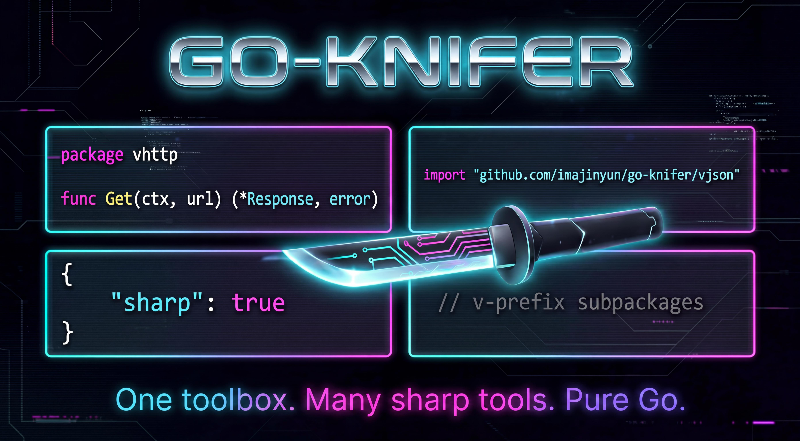

# 🔪 go-knifer

> 🍬 A set of Go tools that keep development sharp.<br>
> 一组让 Go 开发保持锋利、轻巧、稳定的实用工具。



[](https://pkg.go.dev/github.com/imajinyun/go-knifer)
[](https://go.dev/)
[](https://github.com/imajinyun/go-knifer/actions/workflows/go.yml)
[](./LICENSE)

## 📑 Table of Contents / 目录

- [📚 Introduction / 简介](#introduction)
- [✨ Why go-knifer / 为什么选择 go-knifer](#why-go-knifer)
- [🚀 Install / 安装](#install)
- [🧭 Find by scenario / 按场景查找](#find-by-scenario)
- [🧩 Package catalog / 包目录](#package-catalog)
- [🏗️ Architecture / 架构](#architecture)
- [✅ Recommended APIs / 推荐 API](#recommended-apis)
- [📖 Documentation / 文档](#documentation)
- [📦 Build and test / 构建与测试](#build-and-test)
- [🛡️ Governance / 治理](#governance)
- [🤝 Contributing / 贡献](#contributing)
- [⭐ Star go-knifer / 支持项目](#star-go-knifer)

<a id="introduction"></a>

## 📚 Introduction / 简介

`go-knifer` is a practical utility toolkit for Go projects. It collects frequently used capabilities—string helpers, collection utilities, encoding/decoding, cryptography, HTTP, JSON, cache, cron, JWT, logging, configuration, and system information—into reusable packages.

`go-knifer` 是一个面向 Go 项目的实用工具集合，将字符串、集合、编解码、密码学、HTTP、JSON、缓存、定时任务、JWT、日志、配置、系统信息等常用能力沉淀为可复用的包。

The root package `github.com/imajinyun/go-knifer` is only the module entry point. Actual APIs live in public `v*` facade packages so applications can import only the domain they need.

根包 `github.com/imajinyun/go-knifer` 仅作为模块入口；真正的 API 按领域拆分在公开的 `v*` facade 包中，业务代码可以只导入需要的能力域。

<a id="why-go-knifer"></a>

## ✨ Why go-knifer / 为什么选择 go-knifer

`knifer` comes from “knife”: a handy little tool for solving common everyday problems in Go development.

`knifer` 源于 “knife”：像随身小刀一样，专注解决 Go 日常开发中的高频小问题。

- 🧰 **Focused facades / 聚焦的 facade 包**：import `vstr`, `vslice`, `vhttp`, `vcrypto`, and other domain packages directly. / 直接导入 `vstr`、`vslice`、`vhttp`、`vcrypto` 等领域包。
- 🧪 **Testable options / 易测试的选项模式**：many APIs provide `WithXxx` options and provider injection for deterministic tests. / 许多 API 提供 `WithXxx` 选项和 provider 注入，便于编写确定性测试。
- 🛡️ **Safe defaults / 安全默认值**：security-sensitive helpers prefer explicit errors, bounded reads, SSRF-aware URL access, and path traversal checks. / 涉及安全的工具优先使用显式错误、有界读取、SSRF 感知访问与路径穿越检查。
- 📚 **Domain docs / 领域文档**：detailed quickstarts live under [`docs/doc`](./docs/doc/README.md), keeping this README easy to scan. / 详细 quickstart 下沉到 [`docs/doc`](./docs/doc/README.md)，根 README 保持轻量易读。

<a id="install"></a>

## 🚀 Install / 安装

Go 1.25 or later is required.<br>
需要 Go 1.25 或更高版本。

```bash
go get github.com/imajinyun/go-knifer
```

<a id="find-by-scenario"></a>

## 🧭 Find by scenario / 按场景查找

Not sure which package to import? Start from what you want to do.<br>
不确定该导入哪个包？可以先从你的使用场景开始查找。

| I want to… / 我想要… | Use / 使用 |
| --- | --- |
| Cache with FIFO/LRU/LFU/TTL<br>使用 FIFO/LRU/LFU/TTL 缓存 | [`vcache`](docs/doc/04-vcache.md) |
| Base64 / Hex encode-decode<br>Base64 / Hex 编解码 | [`vcodec`](docs/doc/05-vcodec.md) |
| Load local or remote configuration safely<br>安全加载本地或远程配置 | [`vconf`](docs/doc/06-vconf.md) |
| SHA/HMAC, AES-GCM/RSA-PSS, sign parameters<br>SHA/HMAC、AES-GCM/RSA-PSS、参数签名 | [`vcrypto`](docs/doc/09-vcrypto.md) |
| Send HTTP requests with standard library helpers<br>使用标准库封装发送 HTTP 请求 | [`vhttp`](docs/doc/18-vhttp.md) |
| Send HTTP requests with Resty-based helpers<br>使用 Resty 封装发送 HTTP 请求 | [`vresty`](docs/doc/37-vresty.md) |
| Generate UUID / Snowflake / NanoId<br>生成 UUID / Snowflake / NanoId | [`vid`](docs/doc/19-vid.md) |
| Mask sensitive data<br>脱敏敏感数据 | [`vmask`](docs/doc/28-vmask.md) |
| Create, query, transform, merge, diff, or sort maps<br>创建、查询、转换、合并、比较或排序 map | [`vmap`](docs/doc/27-vmap.md) |
| Filter / map / dedup / paginate slices<br>过滤、映射、去重或分页 slice | [`vslice`](docs/doc/41-vslice.md) |
| Trim, split, case-convert, compare text, or check blank strings<br>裁剪、拆分、大小写转换、文本比较或空白判断 | [`vstr`](docs/doc/42-vstr.md) |
| Encode/parse URLs or open untrusted HTTP(S) resources safely<br>编码/解析 URL 或安全打开不可信 HTTP(S) 资源 | [`vurl`](docs/doc/45-vurl.md) |

👉 See the [full documentation index](./docs/doc/README.md#package-catalog) for every package.<br>
👉 所有包请查看[完整文档索引](./docs/doc/README.md#package-catalog)。

<a id="package-catalog"></a>

## 🧩 Package catalog / 包目录

`go-knifer` follows an “internal implementation + public facade” layout: `internal/*` contains concrete implementations, while `v*` packages expose stable public APIs.

`go-knifer` 采用“内部实现 + 公开 facade”的结构：`internal/*` 保存具体实现，`v*` 包提供稳定公开 API。

- 📦 Full module matrix / 完整模块矩阵：[`docs/doc/README.md#package-catalog`](./docs/doc/README.md#package-catalog)
- 🔎 Per-package quickstarts / 各包 quickstart：[`docs/doc/*.md`](./docs/doc/README.md#quickstart-documents)
- 🧾 Exported API snapshot / 导出 API 快照：[`docs/api/exports.txt`](./docs/api/exports.txt)

<a id="architecture"></a>

## 🏗️ Architecture / 架构

Application code should import public `v*` packages. `internal/*` packages are implementation details and can evolve without exposing every helper as public API.

业务代码应导入公开的 `v*` 包；`internal/*` 属于实现细节，可以在不暴露所有 helper 的前提下持续演进。

For domain boundary rules, provider-injection patterns, API compatibility policy, error contracts, and safety defaults, see [Architecture and package boundaries](./docs/doc/README.md#architecture-and-package-boundaries).

领域边界、provider 注入模式、API 兼容策略、错误契约与安全默认值，请查看[架构与包边界](./docs/doc/README.md#architecture-and-package-boundaries)。

<a id="recommended-apis"></a>

## ✅ Recommended APIs / 推荐 API

For new code, prefer explicit-error and safe variants when inputs cross a trust boundary.<br>
新代码中，如果输入跨越信任边界，优先选择显式返回错误和安全变体。

| Scenario / 场景 | Recommended API / 推荐 API |
| --- | --- |
| Trusted standard-library HTTP request<br>可信标准库 HTTP 请求 | `vhttp.Get`, `vhttp.Post`, `vhttp.NewRequest` |
| Untrusted HTTP(S) URL<br>不可信 HTTP(S) URL | `vhttp.GetStringSafeE`, `vresty.GetStringSafeE`, `vurl.OpenSafe` |
| User-controlled download target/source<br>用户可控下载目标或来源 | `vhttp.DownloadFileSafe`, `vresty.DownloadFileSafe` |
| Secret bytes, tokens, keys, nonces, or salts<br>密钥、令牌、随机数、nonce 或 salt 字节 | `vrand.SecureBytes` |
| Remote configuration from a trust boundary<br>来自信任边界外的远程配置 | `vconf.LoadRemoteSafe` |

More recommendations are documented in [Recommended API entry points](./docs/doc/README.md#recommended-api-entry-points).<br>
更多建议见[推荐 API 入口](./docs/doc/README.md#recommended-api-entry-points)。

<a id="documentation"></a>

## 📖 Documentation / 文档

- 📚 Documentation hub / 文档中心：[`docs/doc/README.md`](./docs/doc/README.md)
- 🌐 Online Go docs / 在线 Go 文档：[pkg.go.dev/github.com/imajinyun/go-knifer](https://pkg.go.dev/github.com/imajinyun/go-knifer)
- 🧾 API snapshot / API 快照：[`docs/api/exports.txt`](./docs/api/exports.txt)
- 🗺️ AI-oriented project map / 面向 AI 的项目地图：[`llms.txt`](./llms.txt)
- 🧯 Security policy / 安全策略：[`SECURITY.md`](./SECURITY.md)
- 📝 Changelog / 变更日志：[`CHANGELOG.md`](./CHANGELOG.md)

<a id="build-and-test"></a>

## 📦 Build and test / 构建与测试

Clone the source code.<br>
克隆源码：

```bash
git clone https://github.com/imajinyun/go-knifer.git
cd go-knifer
```

Run the common local checks.<br>
运行常用本地检查：

```bash
make test        # unit tests / 单元测试
make ci-test     # CI test-job gates / CI 测试任务门禁
make check       # full local gate / 完整本地门禁
```

Useful focused commands.<br>
常用专项命令：

```bash
make quick-check
make security-check
make bench-core
make bench-facade
UPDATE_API=1 make api-check
```

See [Build, test, and release workflow](./docs/doc/README.md#build-test-and-release-workflow) for the full command guide.<br>
完整命令说明见[构建、测试与发布工作流](./docs/doc/README.md#build-test-and-release-workflow)。

<a id="governance"></a>

## 🛡️ Governance / 治理

- Security reports / 安全报告：see [`SECURITY.md`](./SECURITY.md). Please do not disclose suspected vulnerabilities in public issues. / 请查看 [`SECURITY.md`](./SECURITY.md)，不要在公开 issue 中披露疑似漏洞。
- Release notes / 发布说明：see [`CHANGELOG.md`](./CHANGELOG.md). User-visible changes should be recorded before tagging a release. / 用户可见变更应在发布 tag 前记录到 [`CHANGELOG.md`](./CHANGELOG.md)。
- Coverage/API/workflow gate details / 覆盖率、API 与工作流门禁详情：see [Governance](./docs/doc/README.md#governance). / 请查看[治理](./docs/doc/README.md#governance)。

<a id="contributing"></a>

## 🤝 Contributing / 贡献

Pull requests are welcome. Please add new capabilities to the appropriate `internal/*` implementation package first, expose public APIs from the corresponding `v*` package, add comments/tests, run local checks, and keep code formatted with `gofmt`.

欢迎提交 Pull Request。请优先将新能力添加到合适的 `internal/*` 实现包，再通过对应 `v*` 包暴露公开 API；同时补充注释和测试，运行本地检查，并保持 `gofmt` 格式化。

For issue templates, PR principles, and gate expectations, see [Contributing](./docs/doc/README.md#contributing).<br>
Issue 信息、PR 原则与门禁要求，请查看[贡献指南](./docs/doc/README.md#contributing)。

<a id="star-go-knifer"></a>

## ⭐ Star go-knifer / 支持项目

If this project helps you reduce repeated code, please consider giving it a Star. Your feedback and contributions will help make it a sharper Go utility toolkit.

如果这个项目帮助你减少重复代码，欢迎给它一个 Star。你的反馈和贡献会让它成为更锋利的 Go 工具箱。
